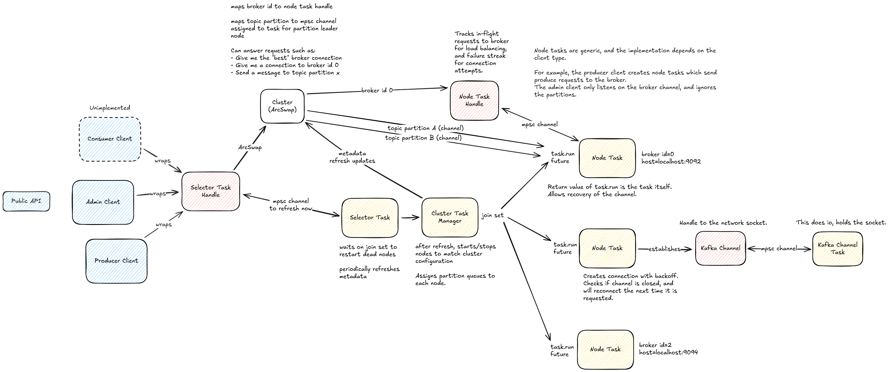

# Kafka Client

This is a Kafka client written in pure Rust.

It uses [kafka-protocol](https://github.com/tychedelia/kafka-protocol-rs) for the protocol implementation, and [tokio](https://github.com/tokio-rs/tokio) for async io.

## Features

- Multiplexed, async IO
- Client-side load balancing
- Connection retry with exponential backoff
- Generic over the IO channel
- Custom partitioning strategies

## Architecture

## To Do

- Producer

  - Implement automatic retry in a way that can guarantee message order
  - Implement idempotent producer
  - Implement transactions
  - The Java client buffers per-partition. Do we want the same?

- Consumer

  - Figure out how groups actually work

- Respect the throttle time returned by the server.

- Other questions:

  - What is the difference between `offset` and `sequence` in the context of a `ProduceRequest`?

- Benchmarking

  - See if producer can hit 800k records/s: https://engineering.linkedin.com/kafka/benchmarking-apache-kafka-2-million-writes-second-three-cheap-machines
  - Update: we are pretty close I think. I did a local benchmark with random data, and hit 1M records/s. See the `ProduceRandom` implementation in `cmd/producer.rs` for how that works.
  - It seems like sending to one partition is faster than multiple right now.

- More tracing

- More tests
